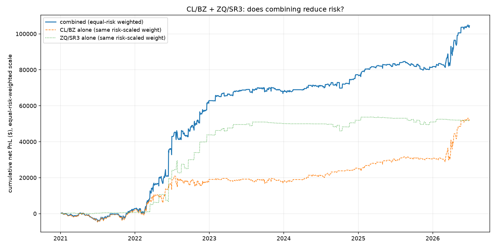
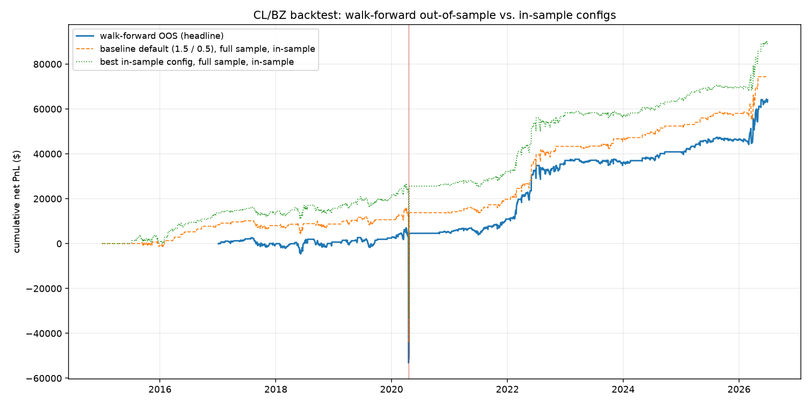

# Relative-Value Trading in CME Futures with Databento Data

A two-pair relative-value strategy on CME futures, built end to end from Databento settlement data. The headline: an equal-risk portfolio of two cointegrated pairs, WTI vs Brent crude oil (CL/BZ) and Fed Funds vs SOFR (ZQ/SR3), earns a net Sharpe ratio of **1.42** over 2021-2026, versus 1.02 for CL/BZ alone. Every estimated quantity behind that number (hedge ratios, entry thresholds, the seasonality screen) was selected walk-forward on prior data only, and the honest single-pair, full-sample result is deliberately modest: net Sharpe 0.26 after costs over 2015-2026. The project's real product is the pipeline and the validation discipline that make these numbers believable.



## What we built

An end-to-end research pipeline on Databento CME data (GLBX.MDP3): official daily settlement prices for nine futures roots, 2014-2026, via continuous front-month contracts. Eleven stages run in sequence, each reading the prior stage's saved artifacts: ingestion, pair selection, spread modeling, signal generation, backtesting with costs, then extensions (per-fold hedge-ratio refits, a second pair, portfolio combination, risk overlays, regime sizing, seasonality). The full post-ingestion run takes under a minute.

## The data overruled the plan

The original proposal (preserved in [docs/PLANNING.md](docs/PLANNING.md)) targeted interest-rate futures. Ranking six candidate pairs on cointegration, mean-reversion speed, hedge-ratio stability, and price staleness overturned that choice: CL/BZ is the only pair whose cointegration survives every subsample window.

| Pair | Instruments | Engle-Granger p | Half-life (days) | Rolling beta range | Stale prices |
|---|---|---|---|---|---|
| **CL/BZ** | **WTI crude oil vs Brent crude oil** | **0.00004** | **4.1** | **0.74 to 1.14** | **0.6%** |
| ZQ/SR3 | 30-Day Fed Funds vs 3-Month SOFR | 0.0003 | 12.4 | -0.46 to 2.40 | 48% |
| CL/HO | WTI crude oil vs NY Harbor heating oil (ULSD) | 0.016 | 14.2 | 8.7 to 45.7 | 0.6% |
| ZN/ZB | 10-Year T-Note vs 30-Year T-Bond | 0.049 | 85.5 | 0.07 to 0.62 | 1.9% |
| ZF/ZN | 5-Year T-Note vs 10-Year T-Note | 0.359 | 94.5 | 0.19 to 0.87 | 1.9% |
| ZT/ZF | 2-Year T-Note vs 5-Year T-Note | 0.395 | 144.6 | 0.01 to 0.56 | 4.5% |

ZQ/SR3 ranked second, but its cointegration decays out of sample and its hedge ratio is unstable, so it was retained as a small diversifier rather than the core position. One data fact shaped the whole model: CL settled at **-$37.63** on April 20, 2020, so the spread is fit by OLS in price space (CL = $\alpha + \beta$, log prices are impossible) and that day is never filtered out of any headline number.

## Strategy and results

The fitted hedge ratio is $\beta = 0.97$ with a 4.1-day spread half-life. The signal is a rolling z-score of the spread (126-session window, shifted one session so today's settlement never helps define the statistics it is judged against). Enter long or short the spread when $|z| \geq 1.5$, exit at $|z| \leq 0.5$, execute at the next session's settlement. Costs are 2 bps per trade plus 0.5 bps per day of financing, stated placeholders pending real fill data.

- **Full sample (Dec 2014 to Jun 2026):** net Sharpe 0.26, $74k net PnL on a one-lot book, 91% trade hit rate, 41% max drawdown against average notional.
- **Walk-forward:** thresholds re-chosen each year on prior years only give an out-of-sample net Sharpe of 0.25, versus 0.32 for the best in-sample configuration. The overfitting gap is real but small.
- **Vol-regime sizing:** scaling positions down in the highest-volatility regime raises net Sharpe to 0.37 and halves the max drawdown to 22%.
- **Two-pair portfolio:** combining CL/BZ with ZQ/SR3 at equal risk lifts the Sharpe to 1.42 on the 2021-2026 common window.



## What did not work

Reported rather than buried, because honest nulls are evidence the testing discipline functions. Volatility targeting and a drawdown gate both reduced net Sharpe (to 0.09 and 0.10 respectively; combined they lose money). Monthly seasonality in the spread is statistically absent (joint F-test p > 0.99); the seasonal overlay gates itself on per-fold significance and correctly never activates.

## Limitations

Cost assumptions are placeholders, so net numbers are indicative rather than tradable. Ingestion has one known, documented, immaterial bug (a stale-timestamp duplicate of the April 2020 print, roughly $6 of a $55k move). ZQ/SR3's out-of-sample dollar PnL is tiny ($217 net), so the portfolio Sharpe of 1.42 is a risk-scaled result on a short window, not a claim of large capacity. Methodology details for the core stages live in [docs/](docs/); the extension stages are documented in their module docstrings.

## How to reproduce

### 1. Clone and install

This project uses [`uv`](https://docs.astral.sh/uv/) for dependency and environment management. Python 3.14 is pinned in `.python-version`; `uv` provisions it automatically.

```bash
git clone https://github.com/amazingmazy/Futures-UChicago-Project.git
cd Futures-UChicago-Project
uv sync
```

### 2. Set up the Databento API key

```bash
cp .env.example .env
```

Then add your key to `.env`:

```text
DATABENTO_API_KEY=your_api_key_here
```

Do not commit `.env`.

### 3. Run the tests (no data or key needed)

```bash
uv run pytest
```

The test suite is fully synthetic, so it works on a fresh clone before any download.

### 4. Pull the data

```bash
uv run python -m src.data.ingest
```

This pulls continuous daily settlement prices for all nine roots into `data/raw/` and writes the processed panel to `data/processed/continuous_settlement_prices.parquet`. The `data/` folder is gitignored, so this step must run once locally. The pull is resumable: roots whose raw files already exist are skipped.

### 5. Run the analysis

Run the stages in this order. Each stage reads the saved outputs of earlier stages, not the Databento API.

```bash
uv run python -m src.analysis.exploratory_analysis   # EDA and pair selection tables/figures
uv run python -m src.models.spread                   # CL/BZ hedge ratio and spread artifacts
uv run python -m src.strategy.signals                # z-score entry/exit signals
uv run python -m src.strategy.backtest               # PnL, costs, threshold sweep, walk-forward
uv run python -m src.strategy.walkforward_beta       # per-fold hedge-ratio refit
uv run python -m src.strategy.run_zq_sr3             # ZQ/SR3 second-pair comparison
uv run python -m src.strategy.portfolio              # combines the two pairs (needs the two lines above)
uv run python -m src.strategy.risk_overlay           # vol-target and drawdown-gate overlays
uv run python -m src.strategy.regime                 # vol-regime position sizing
uv run python -m src.models.seasonality              # walk-forward monthly seasonality
```

The full downstream run takes under a minute on the daily panel.

### 6. Review outputs

All results land in `outputs/figures/` (26 numbered PNGs) and `outputs/tables/` (23 CSVs); both are committed, so every figure and table cited above can be inspected without running anything.
