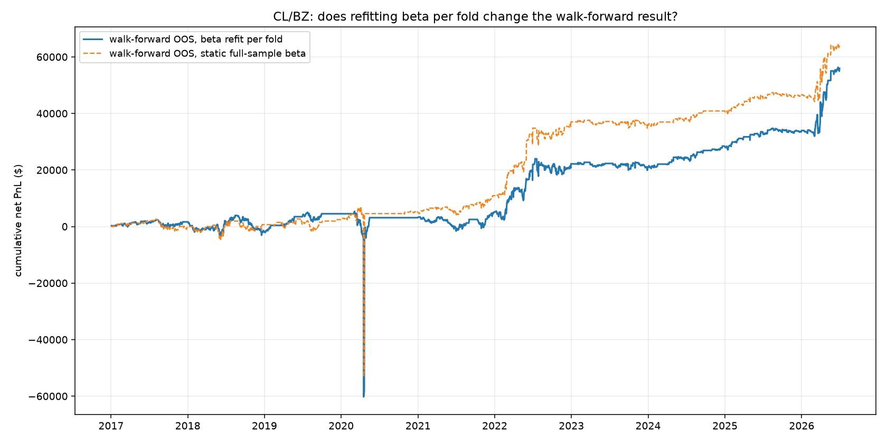
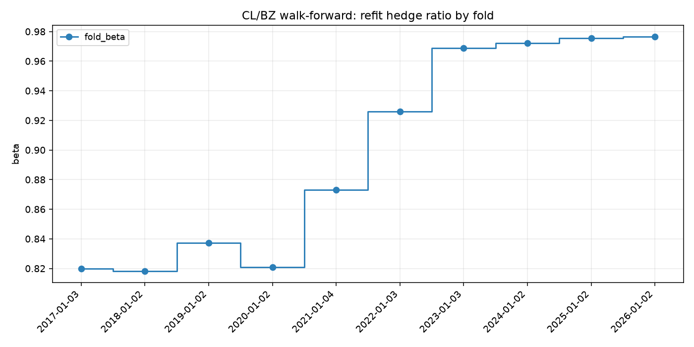

# Mean-Reverting the WTI/Brent Spread: A Walk-Forward Futures Strategy on Databento Data

A z-score mean-reversion strategy on the CL/BZ (WTI vs Brent crude oil) futures spread, built end to end from Databento CME settlement data. With entry/exit thresholds re-chosen each year on prior data only, the strategy earns a fully out-of-sample net Sharpe of **0.25** after costs over 2017-2026. Midway through validation we identified a second, subtler leakage vector: the hedge ratio itself was still one static, full-sample estimate, even though the thresholds were being chosen walk-forward. Refitting the hedge ratio alongside the thresholds barely moves the result (net Sharpe **0.22**). A small delta that is itself the finding: the hedge ratio is genuinely stable, not an artifact of the static fit peeking at the future. No number in this report filters out April 2020, when WTI settled below zero. The strategy is modest by design; the point is that every reported result, including the ones that failed, survives a strict no-lookahead discipline.



## How we chose the pair

The original proposal (preserved in [docs/PLANNING.md](docs/PLANNING.md)) targeted interest-rate futures. We expanded the candidate universe to six pairs across nine CME roots (2014-2026 daily settlements) and ranked them on cointegration, mean-reversion speed, hedge-ratio stability, and price staleness — which overturned that choice. CL/BZ is the only pair whose cointegration survives every subsample window:

| Pair | Instruments | Engle-Granger p | Half-life (days) | Rolling beta range | Stale prices |
|---|---|---|---|---|---|
| **CL/BZ** | **WTI crude oil vs Brent crude oil** | **0.00004** | **4.1** | **0.74 to 1.14** | **0.6%** |
| ZQ/SR3 | 30-Day Fed Funds vs 3-Month SOFR | 0.0003 | 12.4 | -0.46 to 2.40 | 48% |
| CL/HO | WTI crude oil vs NY Harbor heating oil (ULSD) | 0.016 | 14.2 | 8.7 to 45.7 | 0.6% |
| ZN/ZB | 10-Year T-Note vs 30-Year T-Bond | 0.049 | 85.5 | 0.07 to 0.62 | 1.9% |
| ZF/ZN | 5-Year T-Note vs 10-Year T-Note | 0.359 | 94.5 | 0.19 to 0.87 | 1.9% |
| ZT/ZF | 2-Year T-Note vs 5-Year T-Note | 0.395 | 144.6 | 0.01 to 0.56 | 4.5% |

The economics back the statistics: WTI and Brent price the same commodity in two locations, linked by physical arbitrage, so their spread has a reason to mean-revert. Both contracts are 1,000 barrels quoted in $/bbl on CME Globex, so the roughly 1:1 hedge ratio is also close to dollar-neutral. One data fact shaped the model: CL settled at **-$37.63** on April 20, 2020, so the spread is fit by OLS in price space ($CL = \alpha + \beta \, BZ$, log prices are undefined for negative values), giving a hedge ratio $\beta = 0.97$ and a 4.1-day spread half-life.

## Strategy

Going long the spread means long 1 CL contract and short $\beta$ BZ contracts; short the spread reverses both legs. Since $\text{spread}_t = CL_t - \alpha - \beta \, BZ_t$ with $\alpha$ constant, the position's daily PnL is

$$
\Delta\text{PnL}_t = \text{position}_{t-1} \times (\Delta CL_t - \beta \, \Delta BZ_t),
$$

so it depends only on how CL and BZ move relative to each other, not on the outright direction of oil prices -- a genuine hedge, not just a naming convention.

The signal is a rolling z-score of the spread over a 126-session window, with the rolling mean and volatility shifted one session so today's settlement never helps define the statistics it is judged against. Enter long or short the spread at $|z| \geq 1.5$, exit at $|z| \leq 0.5$, execute at the next session's settlement. Costs are 2 bps per trade plus 0.5 bps per day of financing, stated placeholders pending real fill data.

## Results

All numbers are net of costs, from the committed tables in `outputs/tables/`.

- **Full sample (Dec 2014 to Jun 2026), in-sample:** net Sharpe 0.26, $74k net PnL on a one-lot book, 91% trade hit rate, 41% max drawdown against average notional.
- **Walk-forward, thresholds only:** entry/exit thresholds re-chosen each year using only prior years give an out-of-sample net Sharpe of 0.25, versus 0.32 for the best in-sample configuration -- a real but modest overfitting gap.
- **Walk-forward, thresholds and hedge ratio (the final, honest number):** refitting the hedge ratio itself walk-forward too, not just the thresholds, gives an out-of-sample net Sharpe of 0.22. The two walk-forward numbers are close, which is the point: the static hedge ratio used everywhere else in this project was not secretly benefiting from look-ahead information.



The refit hedge ratio stays in a tight 0.82-0.98 band across all ten folds.

## What did not work

Reported rather than buried, because honest nulls are evidence the testing discipline functions. Volatility targeting and a drawdown gate both reduced net Sharpe (to 0.09 and 0.10 respectively; combined they lose money). Monthly seasonality in the spread is statistically absent in the full sample (joint F-test p > 0.99); the seasonal overlay's significance gate fires only in the earliest, data-poor folds (2017-2020) and correctly goes quiet from 2021 on as the effect washes out.

## Limitations

Cost assumptions are placeholders, so net results are indicative rather than tradable, and a one-lot book says nothing about capacity -- this repo has no order-book depth data to size real capacity. Ingestion has one known, documented, immaterial bug (a stale-timestamp duplicate of the April 2020 print, roughly $6 of a $55k move). Methodology detail, plus a data-coverage caveat on ranking, lives in [docs/](docs/).

## Extensions

Beyond the core single-pair strategy above, the repo explores several extensions, each documented in its own module docstring:

- **Vol-regime position sizing** (`src/strategy/regime.py`): scaling exposure down in the highest-volatility regime raises net Sharpe to 0.37 and roughly halves the max drawdown, to 22%, mostly by shrinking exposure through April 2020.
- **A second pair and portfolio combination** (`src/strategy/run_zq_sr3.py`, `src/strategy/portfolio.py`): ZQ/SR3 (Fed Funds vs SOFR) ranked second in pair selection but was rejected as the core strategy -- its cointegration decays out of sample and its hedge ratio is unstable. Combined with CL/BZ at equal risk, the two-pair portfolio reaches a net Sharpe of 1.42 over the shared 2021-2026 out-of-sample window, versus 1.02 for CL/BZ alone over that same shorter window -- a real diversification benefit, though ZQ/SR3's own out-of-sample PnL is tiny ($217 net), so this is a risk-scaled result, not a capacity claim.

## How to reproduce

### 1. Clone and install

This project uses [`uv`](https://docs.astral.sh/uv/) for dependency and environment management. Python 3.14 is pinned in `.python-version`; `uv` provisions it automatically.

```bash
git clone https://github.com/amazingmazy/Futures-UChicago-Project.git
cd Futures-UChicago-Project
uv sync
```

### 2. Set up the Databento API key

```bash
cp .env.example .env
```

Then add your key to `.env`:

```text
DATABENTO_API_KEY=db-XXXXXXXXXXXXXXXXXXXX
```

Do not commit `.env`.

### 3. Run the tests (no data or key needed)

```bash
uv run pytest
```

The test suite is fully synthetic, so it works on a fresh clone before any download.

### 4. Pull the data

```bash
uv run python -m src.data.ingest
```

This pulls continuous daily settlement prices for all nine roots into `data/raw/` and writes the processed panel to `data/processed/continuous_settlement_prices.parquet`. The `data/` folder is gitignored, so this step must run once locally. Expect **1-5 hours depending on connection**. Databento's streaming API occasionally drops a request mid-fetch (`BentoError: Response ended prematurely`); the pull is resumable, so just re-run the same command -- roots whose raw files already exist are skipped, so it picks up where it left off.

### 5. Run the core analysis

Run the stages in this order. Each stage reads the saved outputs of earlier stages, not the Databento API.

```bash
uv run python -m src.analysis.exploratory_analysis   # EDA and pair selection (the ranking table above)
uv run python -m src.models.spread                   # CL/BZ hedge ratio and spread artifacts
uv run python -m src.strategy.signals                # z-score entry/exit signals
uv run python -m src.strategy.backtest               # PnL, costs, threshold sweep, walk-forward
uv run python -m src.strategy.walkforward_beta        # per-fold hedge-ratio refit -- the final core result
```

This reproduces every number in the Results section above. Runtime is well under a minute on the daily panel.

### 6. Run the extensions (optional)

Not required for any number in the Results section; each is documented in its own module docstring.

```bash
uv run python -m src.strategy.regime                 # vol-regime position sizing
uv run python -m src.strategy.run_zq_sr3             # ZQ/SR3 second-pair comparison
uv run python -m src.strategy.portfolio              # combines CL/BZ and ZQ/SR3 (needs run_zq_sr3 above, and walkforward_beta from the core steps)
uv run python -m src.strategy.risk_overlay           # vol-target and drawdown-gate overlays
uv run python -m src.models.seasonality              # walk-forward monthly seasonality
```

### 7. Review outputs

All results land in `outputs/figures/` (26 numbered PNGs) and `outputs/tables/` (23 CSVs); both are committed, so every figure and table cited above can be inspected without running anything.
