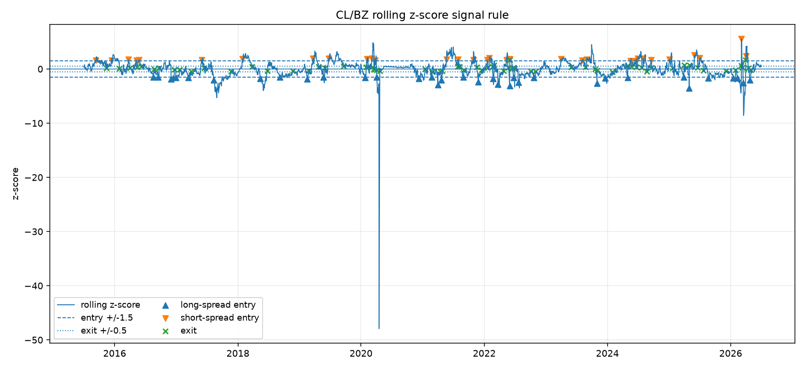
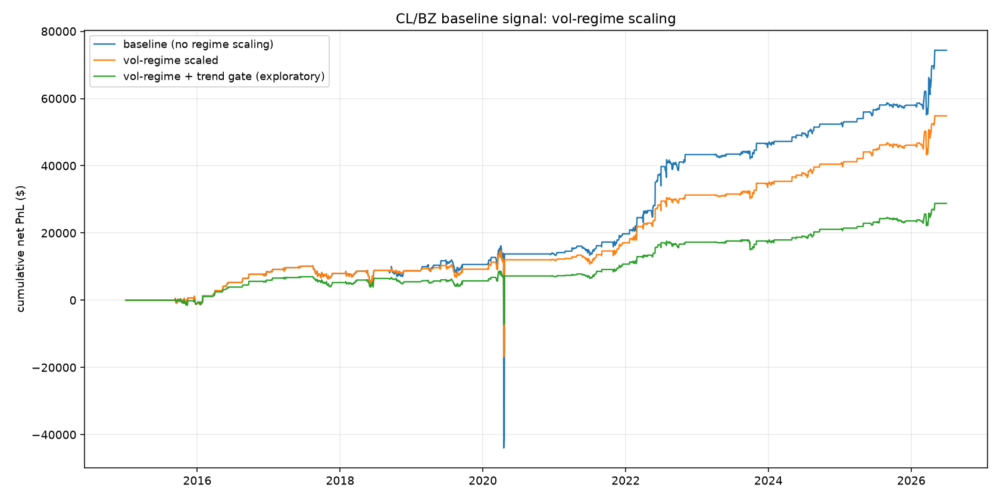

# Mean-Reverting the WTI/Brent Spread: A Walk-Forward Futures Strategy on Databento Data

A z-score mean-reversion strategy on the CL/BZ (WTI vs Brent crude oil) futures spread, built end to end from Databento CME settlement data. The headline: with entry thresholds re-chosen each year on prior data only, the strategy earns a fully out-of-sample net Sharpe of **0.25** after costs over 2017-2026, and volatility-regime sizing lifts it to **0.37** while halving the max drawdown. No number in this report filters out April 2020, when WTI settled below zero. The strategy is modest by design; the point is that every reported result survives a strict no-lookahead discipline, and the numbers that failed that discipline are reported too.


## How we chose the pair

The original proposal (preserved in [docs/PLANNING.md](docs/PLANNING.md)) targeted interest-rate futures. Ranking six candidate pairs from nine CME roots (2014-2026 daily settlements) on cointegration, mean-reversion speed, hedge-ratio stability, and price staleness overturned that choice. CL/BZ is the only pair whose cointegration survives every subsample window:

| Pair | Instruments | Engle-Granger p | Half-life (days) | Rolling beta range | Stale prices |
|---|---|---|---|---|---|
| **CL/BZ** | **WTI crude oil vs Brent crude oil** | **0.00004** | **4.1** | **0.74 to 1.14** | **0.6%** |
| ZQ/SR3 | 30-Day Fed Funds vs 3-Month SOFR | 0.0003 | 12.4 | -0.46 to 2.40 | 48% |
| CL/HO | WTI crude oil vs NY Harbor heating oil (ULSD) | 0.016 | 14.2 | 8.7 to 45.7 | 0.6% |
| ZN/ZB | 10-Year T-Note vs 30-Year T-Bond | 0.049 | 85.5 | 0.07 to 0.62 | 1.9% |
| ZF/ZN | 5-Year T-Note vs 10-Year T-Note | 0.359 | 94.5 | 0.19 to 0.87 | 1.9% |
| ZT/ZF | 2-Year T-Note vs 5-Year T-Note | 0.395 | 144.6 | 0.01 to 0.56 | 4.5% |

The economics back the statistics: WTI and Brent price the same commodity in two locations, linked by physical arbitrage, so their spread has a reason to mean-revert. One data fact shaped the model: CL settled at **-$37.63** on April 20, 2020, so the spread is fit by OLS in price space ($CL = \alpha + \beta \, BZ$, log prices are undefined for negative values), giving a hedge ratio $\beta = 0.97$ and a 4.1-day spread half-life.

## Strategy

The signal is a rolling z-score of the spread over a 126-session window, with the rolling mean and volatility shifted one session so today's settlement never helps define the statistics it is judged against. Enter long or short the spread at $|z| \geq 1.5$, exit at $|z| \leq 0.5$, execute at the next session's settlement. Costs are 2 bps per trade plus 0.5 bps per day of financing, stated placeholders pending real fill data.



## Results

All numbers are net of costs, from the committed tables in `outputs/tables/`:

- **Full sample (Dec 2014 to Jun 2026):** net Sharpe 0.26, $74k PnL on a one-lot book, 91% trade hit rate, 41% max drawdown against average notional.
- **Walk-forward (the honest number):** thresholds re-chosen each year using only prior years give an out-of-sample net Sharpe of 0.25, versus 0.32 for the best in-sample configuration. The overfitting gap is real but small, evidence the default thresholds were not tuned to the answer.
- **Vol-regime sizing:** scaling positions down when trailing spread volatility is in its highest regime raises net Sharpe to 0.37 and halves the max drawdown to 22%, mostly by shrinking exposure through April 2020.



## What did not work

Reported rather than buried, because honest nulls are evidence the testing discipline functions. Volatility targeting and a drawdown gate both reduced net Sharpe (to 0.09 and 0.10 respectively; combined they lose money). Monthly seasonality in the spread is statistically absent (joint F-test p > 0.99); the seasonal overlay gates itself on per-fold significance and correctly never activates.

## Limitations and extensions

Cost assumptions are placeholders, so net results are indicative rather than tradable, and a one-lot book says nothing about capacity. Ingestion has one known, documented, immaterial bug (a stale-timestamp duplicate of the April 2020 print, roughly $6 of a $55k move). Beyond the core strategy, the repo also contains a second-pair comparison (ZQ/SR3) and an equal-risk portfolio combination as extensions (`src/strategy/run_zq_sr3.py`, `src/strategy/portfolio.py`); see those modules' docstrings.

## How to reproduce

### 1. Clone and install

This project uses [`uv`](https://docs.astral.sh/uv/) for dependency and environment management. Python 3.14 is pinned in `.python-version`; `uv` provisions it automatically.

```bash
git clone https://github.com/amazingmazy/Futures-UChicago-Project.git
cd Futures-UChicago-Project
uv sync
```

### 2. Set up the Databento API key

```bash
cp .env.example .env
```

Then add your key to `.env`:

```text
DATABENTO_API_KEY=your_api_key_here
```

Do not commit `.env`.

### 3. Run the tests (no data or key needed)

```bash
uv run pytest
```

The test suite is fully synthetic, so it works on a fresh clone before any download.

### 4. Pull the data

```bash
uv run python -m src.data.ingest
```

This pulls continuous daily settlement prices for all nine roots into `data/raw/` and writes the processed panel to `data/processed/continuous_settlement_prices.parquet`. The `data/` folder is gitignored, so this step must run once locally. The pull is resumable: roots whose raw files already exist are skipped.

### 5. Run the analysis

Run the stages in this order. Each stage reads the saved outputs of earlier stages, not the Databento API.

```bash
uv run python -m src.analysis.exploratory_analysis   # EDA and pair selection tables/figures
uv run python -m src.models.spread                   # CL/BZ hedge ratio and spread artifacts
uv run python -m src.strategy.signals                # z-score entry/exit signals
uv run python -m src.strategy.backtest               # PnL, costs, threshold sweep, walk-forward
uv run python -m src.strategy.risk_overlay           # vol-target and drawdown-gate overlays
uv run python -m src.strategy.regime                 # vol-regime position sizing
uv run python -m src.models.seasonality              # walk-forward monthly seasonality
```

The full downstream run takes under a minute on the daily panel. The extension stages (`src.strategy.walkforward_beta`, `src.strategy.run_zq_sr3`, `src.strategy.portfolio`) run the same way and are not needed for any number above.

### 6. Review outputs

All results land in `outputs/figures/` (numbered PNGs) and `outputs/tables/` (CSVs); both are committed, so every figure and table cited above can be inspected without running anything.
