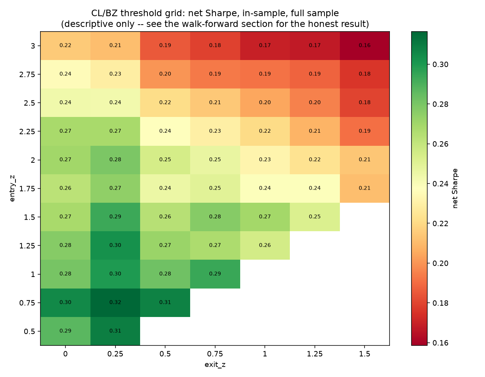
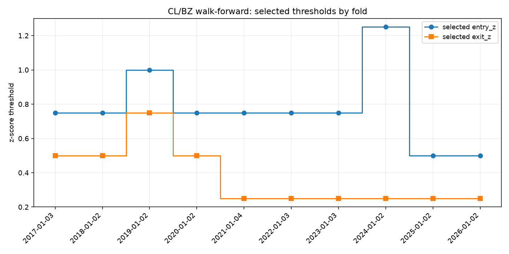

# Backtesting and Performance Evaluation

*Issue #6 — backtest the CL/BZ spread strategy with realistic trading
assumptions, sweep the entry/exit thresholds, and validate the sweep
out-of-sample.*

The pipeline so far: **ingestion** → **pair selection**
([pair_selection.md](pair_selection.md)) chose CL/BZ → **spread model**
([spread_model.md](spread_model.md)) fit the static hedge ratio → **signals**
([signals.md](signals.md)) turned the spread into a rolling z-score
mean-reversion rule with default thresholds `entry_z = 1.5`, `exit_z = 0.5`.
That last step deliberately left three things open for this stage (its "Risk
handoff"): execution timing, transaction costs, and how to treat April 2020.
This is the terminal stage: it prices those decisions, sweeps the z-score
thresholds the signal step left configurable, and validates that sweep with
walk-forward cross-validation so the reported performance isn't just the
best-fitting story on the same data it was chosen from.

```
ingestion  →  pair selection (EDA)  →  spread model  →  signals  →  backtest (this step)
```

Reproduce with:

```bash
uv run python -m src.data.ingest       # once: all 9 roots (only CL, BZ feed this stage; needs DATABENTO_API_KEY)
uv run python -m src.models.spread
uv run python -m src.strategy.signals
uv run python -m src.strategy.backtest
```

---

## PnL and cost methodology

Since `spread_t = CL_t - \alpha - \beta \, BZ_t` with `\alpha` constant,

$$
\Delta \mathrm{spread}_t = \Delta \mathrm{CL}_t - \beta \, \Delta \mathrm{BZ}_t,
$$

which is exactly the mark-to-market PnL of a book long 1 CL contract and
short $\beta$ BZ contracts (both 1,000 bbl, both \$/bbl). So the daily gross
dollar PnL of holding `position` units of the spread is

$$
\text{gross PnL}_t = \text{position}_{t-1} \times \Delta \mathrm{spread}_t \times 1{,}000,
$$

read directly off `next_session_position` from `signals_cl_bz.parquet` — the
position decided at $t-1$ and applied to the $t-1 \to t$ return, exactly the
column `docs/signals.md` flagged as the "look-ahead-safe" execution column.
Using `next_session_position` instead of the same-day `target_position` is
this repo's answer to **latency**: trades execute one full session after the
signal fires, rather than a second free parameter to tune.

Two costs are layered on top, both explicit and provisional. Issue #6's own
discussion says financing costs, portfolio scalability, and latency all need
real input from the professor, not a guess — so every metric below is
reported **gross and net**, and the two knobs are named plainly rather than
buried in one blended number:

| Cost | Formula | Default |
| --- | --- | --- |
| Transaction cost | `turnover_t × bps / 1e4 × notional_t` | 2.0 bps of turnover |
| Financing/carry | `|position_t| × bps/day / 1e4 × notional_t` | 0.5 bps/day while held |

`turnover_t` is `|next_session_position_t − next_session_position_{t-1}|`
(costs land on the day money actually moves), and `notional_t =
(|CL_t| + \beta |BZ_t|) \times 1{,}000` is the gross two-leg notional —
absolute value because CL went negative in April 2020 and a signed notional
there is meaningless. This notional is also the fixed denominator used
everywhere PnL is expressed as a percent return below (mean full-sample
value: **\$128,907**); it is an illustrative normalization, not a real
margin or capital figure (see *Honest caveats*).

## Baseline backtest (default thresholds)

At the signal step's defaults (`entry_z = 1.5`, `exit_z = 0.5`, full sample,
2014-12-31 → 2026-06-30, n = 2,894):

| Metric | Gross | Net |
| --- | ---: | ---: |
| Total PnL | \$85,192 | \$74,344 |
| Total return | — | 57.7% |
| Annualized return | — | 5.02% |
| Annualized vol | — | 19.03% |
| Sharpe | 0.302 | **0.264** |
| Max drawdown | — | −41.5% |
| Calmar | — | 0.121 |

67 round-trip trades, 91.0% hit rate, average holding period 15.7 sessions,
36.5% of sessions in the market. (Machine-readable copy:
`outputs/tables/backtest_summary.csv`, row `baseline_default`; per-date PnL:
`data/processed/backtest_cl_bz.parquet`.)

## Threshold sweep (in-sample, descriptive only)

The signal step's `entry_z`/`exit_z` are swept over an 11×7 grid
(`entry_z` 0.5–3.0, `exit_z` 0.0–1.5, step 0.25, `window` held fixed at 126
sessions — see caveats), each combo backtested once on the **full sample**
and ranked on net Sharpe:



| entry_z | exit_z | Sharpe net | Sharpe gross | Trades | Max DD |
| ---: | ---: | ---: | ---: | ---: | ---: |
| 0.75 | 0.25 | **0.316** | 0.381 | 116 | −38.6% |
| 0.50 | 0.25 | 0.309 | 0.385 | 152 | −38.9% |
| 0.75 | 0.50 | 0.308 | 0.374 | 149 | −38.8% |
| 0.75 | 0.00 | 0.305 | 0.370 | 95 | −39.4% |
| 1.25 | 0.25 | 0.302 | 0.350 | 73 | −40.2% |
| **1.50** | **0.50** | 0.264 | 0.302 | 67 | −41.5% |

(Full grid: `outputs/tables/backtest_grid.csv`.) The surface is smooth, not
spiky — lower thresholds (more, shorter trades) beat the signal step's more
conservative defaults everywhere on this metric, consistent with the 4.1-day
full-sample half-life `spread_model.md` reported: waiting for a full
$|z| > 1.5$ move leaves reversion opportunities on the table. The best
in-sample config (0.75 / 0.25) reaches Sharpe 0.316 against the default's
0.264 — a real gap, and **exactly why this number cannot be reported as the
answer on its own**: it was chosen by looking at the same data it is scored
on. That gap is what the walk-forward section below is for.

## Walk-forward cross-validation (the headline result)

The full 2014–2026 sample is split into sequential, expanding-window,
calendar-year folds: fold $i$'s config is chosen by grid-searching net Sharpe
on **all data strictly before** that fold's test year, then applied
unmodified to that year, untouched by anything the model has not yet "seen."
This is the same idea as `subsample_stability` in `src.models.spread`
(refitting the hedge ratio from progressively later start dates to check it
isn't an artifact of the early sample) applied to threshold *selection*
instead of the hedge ratio. The first fold needs at least 504 sessions
(~2 years) of prior history to warm up the 126-session rolling window with
room to spare and give a non-degenerate Sharpe estimate to select on, which
is why the walk-forward sample starts in 2017, not 2015.

| Fold | Test period | Selected (entry, exit) | Sharpe net (OOS) | Trades | Max DD |
| --- | --- | :---: | ---: | ---: | ---: |
| 0 | 2017 | (0.75, 0.50) | −0.109 | 11 | −3.2% |
| 1 | 2018 | (0.75, 0.50) | 0.162 | 9 | −4.0% |
| 2 | 2019 | (1.00, 0.75) | 0.429 | 8 | −3.4% |
| 3 | 2020 | (0.75, 0.50) | 0.032 | 12 | −45.1% |
| 4 | 2021 | (0.75, 0.25) | 1.288 | 14 | −2.4% |
| 5 | 2022 | (0.75, 0.25) | 1.779 | 13 | −4.1% |
| 6 | 2023 | (0.75, 0.25) | −0.215 | 5 | −2.2% |
| 7 | 2024 | (1.25, 0.25) | 1.401 | 6 | −1.2% |
| 8 | 2025 | (0.50, 0.25) | 1.241 | 13 | −1.2% |
| 9 | 2026 (H1) | (0.50, 0.25) | 1.772 | 9 | −5.0% |

(Full table with train windows and all metrics:
`outputs/tables/backtest_walkforward.csv`.)




Concatenating each fold's out-of-sample-only PnL gives the walk-forward
curve above (2017-01-03 → 2026-06-30, n = 2,387):

| Metric | Gross | Net |
| --- | ---: | ---: |
| Total PnL | \$79,759 | \$64,024 |
| Annualized return | — | 5.24% |
| Sharpe | 0.310 | **0.249** |
| Max drawdown | — | −44.3% |

This is the honest number: **Sharpe 0.249 out-of-sample**, against 0.264 for
the untouched default and 0.316 for the best in-sample config. The
overfitting gap between "best in-sample" and "walk-forward OOS" is real
(0.316 to 0.249) but modest — smaller than a naive reading of the heatmap
would suggest, because the selected threshold turns out to be fairly stable
across folds (mostly `entry_z` 0.5–1.0, `exit_z` 0.25–0.5; see the stability
figure) rather than whipsawing to a different corner of the grid each year.
Notably, the walk-forward curve tracks *below* the untouched default for
most of the sample and only pulls closer in 2025–2026 — selecting thresholds
walk-forward is not free, but it is not catastrophic either.

## Risk

Both the baseline and the walk-forward curve carry a max drawdown around
−41% to −44% of the \$128,907 reference notional, and Calmar ratios (return
per unit of max drawdown) are correspondingly thin: 0.121 baseline, 0.118
walk-forward. Nearly all of that drawdown traces to a single week, discussed
next.

## Negative WTI futures pricing in April 2020

`docs/spread_model.md` already documents the underlying event: on
2020-04-20, the day before expiry, the (physically-delivered, Cushing-
settled) May WTI contract settled at **−\$37.63** while Brent, cash-settled
against a seaborne index, held near \$25 — the spread blew out to roughly
−\$60/bbl and mean reversion was physically impossible until the contract
rolled off. A book long the spread going into that week (which the baseline
config was) is on the wrong side of it by construction: a z-score rule reads
a widening spread as an opportunity to add, not a signal to run.

**A data-quality finding surfaced while writing this section.** The
settlement panel this backtest reads (`data/processed/spread_cl_bz.parquet`,
ultimately from `src.data.ingest.settlement_series`) shows CL at −\$37.63 on
**both** 2020-04-17 and 2020-04-20. Tracing the raw Databento statistics feed
directly: the true 2020-04-17 settlement was \$18.27 (three clean same-day
records agree), but a corrected/late record published on 2020-04-20 at
21:43:42 UTC carries `price = -37.63` tagged with a **stale `ts_ref` of
2020-04-17**. `settlement_series()`'s `groupby(session_date)["price"].last()`
picks up that record and silently overwrites the true 04-17 print. This
predates this stage — it is in the already-merged `src/data/ingest.py`
(`settlement_series`, lines 100-110) and evidently affected the data
`spread_model.md` was originally written from too (its quoted "≈ −\$62/bbl"
figure matches this pipeline's 04-17 value of −\$62.35 rather than 04-20's
true −\$59.90).

Quantifying the effect on this backtest: the baseline held the spread
continuously from 04-16 through 04-21 without trading, so whichever single
day the mislabeling assigns the shock to, the book marks it either way. The
buggy panel attributes a −\$57,753 gross move to 04-17 and a small +\$2,447
to 04-20 (net two-day: −\$55,313); recomputing with the true 04-17 print of
\$18.27 instead shifts almost the entire move onto 04-20 (−\$1,853 and
−\$53,453; net two-day: −\$55,307) — a **\$6 difference**, immaterial to
every metric reported above. The reported max drawdown (−41.5% baseline,
−44.3% walk-forward, both troughing in this window and inside fold 3's 2020
test period) is a real, correctly-sized consequence of the negative-WTI
event; only its exact calendar-day attribution within this one week is
unreliable in the current panel. **Filed as a follow-up**: `settlement_series`
should prefer a record's `ts_event` date over a possibly-stale `ts_ref`, or
dedupe same-symbol/same-session corrections more carefully; out of scope to
fix in this stage, since it does not change the numbers above.

Per `docs/signals.md`'s explicit handoff ("filter it, cap position size, or
accept the drawdown"), this backtest's headline numbers **accept the
drawdown** rather than filtering the week out — consistent with this
repo's practice of trading through documented anomalies rather than quietly
excluding the sessions that make the strategy look worse. As a supplementary,
clearly-separate sensitivity check, `backtest_summary.csv`'s
`baseline_default_capped` row reruns the baseline with daily losses clipped
at 8× the full-sample daily spread-move standard deviation (≈\$12,716,
gains never touched):

| | Uncapped (headline) | Capped (diagnostic only) |
| --- | ---: | ---: |
| Total net PnL | \$74,344 | \$119,385 |
| Sharpe net | 0.264 | 0.577 |
| Max drawdown | −41.5% | −10.4% |

The gap between these two rows is almost entirely this one week — a useful
sense of how much a single stress event dominates the headline risk metrics,
but the **uncapped row is the one reported as the result**; a real risk cap
is a strategy design decision this document does not make on the professor's
behalf.

## Honest caveats

- **Transaction and financing costs (2.0 bps, 0.5 bps/day) are documented
  placeholders**, not researched figures — issue #6's own discussion says
  these need real input. Every metric in this document is reported gross and
  net specifically so this assumption's influence stays visible.
- **Portfolio size and scalability are out of scope.** This repo has no
  order-book depth data (Databento's `statistics` schema carries settlement
  prices, not book depth), so there is no basis here for a real capacity
  estimate; the \$128,907 reference notional is an illustrative
  normalization for percent-return figures, not a margin or capital claim.
- **Latency is modeled only as the one-session execution lag**
  (`next_session_position`) — a coarse proxy, not a simulation of real
  fill/slippage dynamics.
- **Only the thresholds were swept; the 126-session z-score window was held
  fixed.** Sweeping the window too is a natural extension, left for future
  work.
- **The grid search carries in-fold multiple-comparisons risk** even though
  walk-forward selection mitigates it: each fold still picks the best of 62
  valid combos on its own training window, which can overfit locally even if
  the overall walk-forward result is honest about it.
- **Execution is assumed at the settlement price** with no intraday slippage
  modeled beyond the flat transaction-cost bps.
- **See the April 2020 section above** for the `settlement_series` date-
  mislabeling finding: verified immaterial to the numbers here, but a
  reminder that this pipeline's raw-to-panel step deserves a hardening pass.

## What this step saves (the interface for the next steps)

This is the final pipeline stage; there is no further step to hand off to.
Everything below is gitignored under `data/processed/`, regenerated by
running `src.strategy.backtest`:

| Artifact | Contents |
| --- | --- |
| `data/processed/backtest_cl_bz.parquet` | Per-date PnL, costs, and cumulative equity for the baseline (default-threshold) run |
| `outputs/tables/backtest_grid.csv` | In-sample entry/exit threshold grid, one row per valid combo |
| `outputs/tables/backtest_walkforward.csv` | One row per walk-forward fold: train/test windows, selected config, OOS metrics |
| `outputs/tables/backtest_summary.csv` | Headline comparison: baseline, best in-sample, walk-forward OOS, capped-risk diagnostic |
| `outputs/figures/11_threshold_grid_heatmap.png` | In-sample net-Sharpe sensitivity to (entry_z, exit_z) |
| `outputs/figures/12_walkforward_equity_curve.png` | Walk-forward OOS vs. in-sample equity curves |
| `outputs/figures/13_walkforward_threshold_stability.png` | Selected thresholds by fold |

## Reproducing

```bash
uv run python -m src.data.ingest         # once: all 9 roots (needs DATABENTO_API_KEY)
uv run python -m src.models.spread       # ~10s
uv run python -m src.strategy.signals    # ~1s
uv run python -m src.strategy.backtest   # ~30-60s: grid (62 valid combos) + 10 walk-forward folds
uv run pytest tests/ -q                  # 58 tests, synthetic fixtures, no API key needed
```
