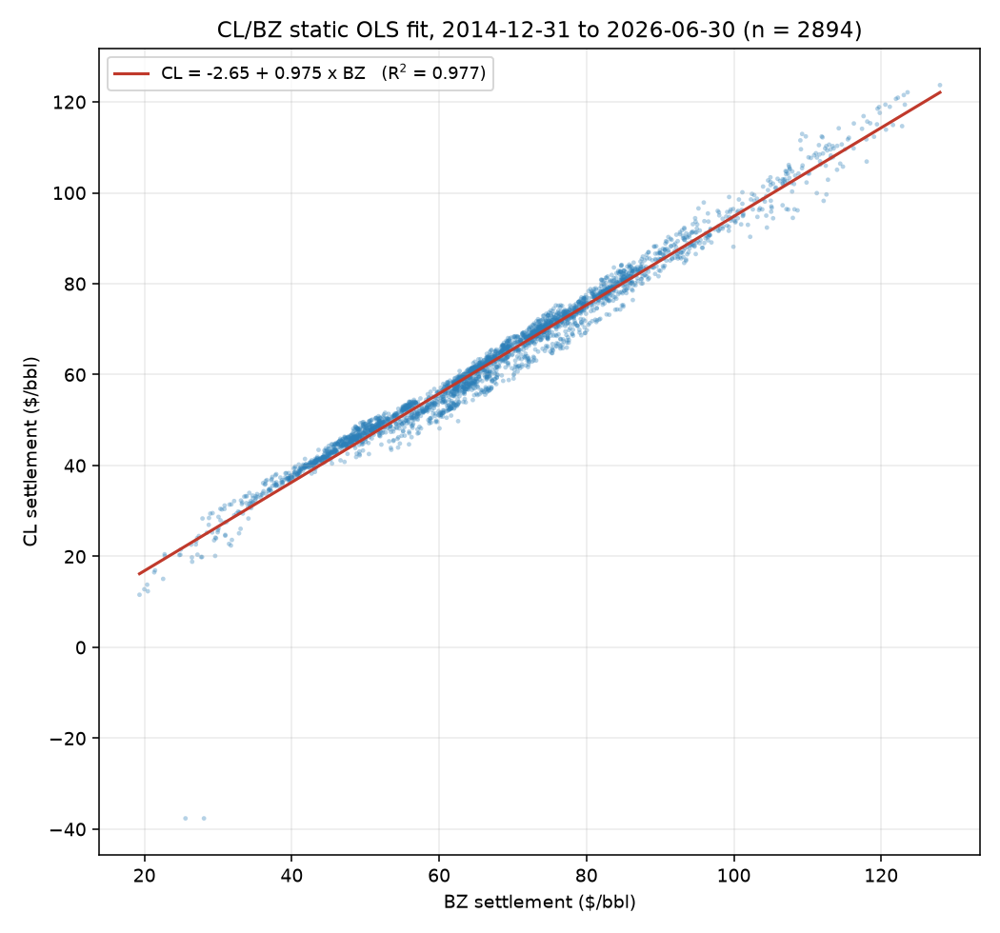
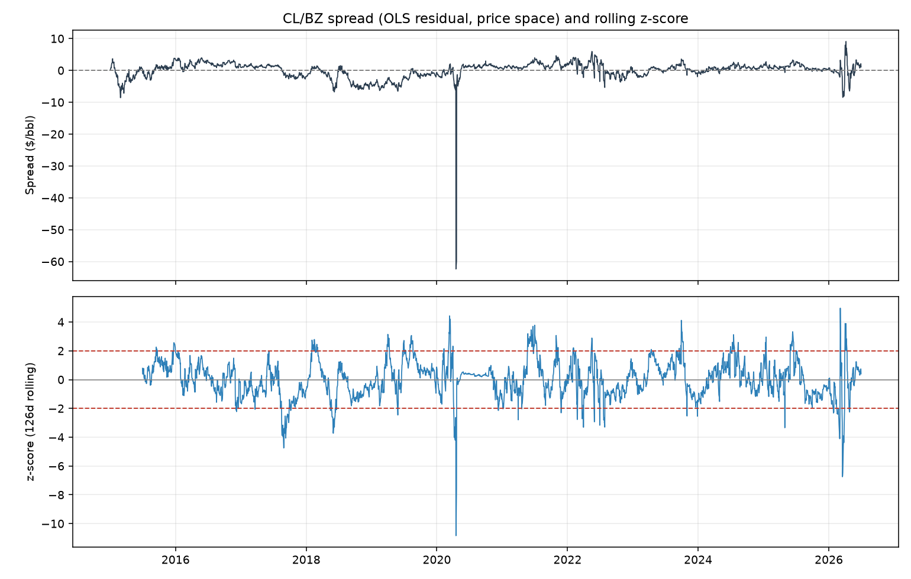
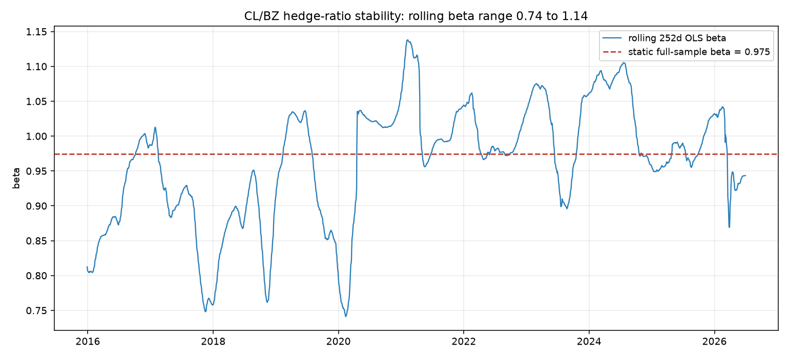

# Modeling the CL/BZ Spread

The pipeline so far: **ingestion** pulled nine CME futures roots from
Databento and wrote a daily settlement-price panel
(`data/processed/continuous_settlement_prices.parquet`), and the **EDA**
([pair_selection.md](pair_selection.md)) ran six candidate pairs through a
set of statistical tests and chose **CL/BZ (WTI vs Brent crude)**, the only
pair whose cointegration holds on every subsample window. This step fits the
model of how CL and BZ normally move together and defines the **spread**,
the deviation from that normal relationship. The signal step decides when to
trade the spread; the backtest evaluates the result. Both read this step's
saved artifacts instead of refitting anything.

```
ingestion  →  pair selection (EDA)  →  spread model (this step)  →  signals  →  backtest
```

Reproduce with:

```bash
uv run python -m src.models.spread
```

---

## The model

$$
\mathrm{CL}_t = \alpha + \beta \, \mathrm{BZ}_t + \varepsilon_t
$$

$$
\mathrm{spread}_t = \mathrm{CL}_t - \alpha - \beta \, \mathrm{BZ}_t
$$

with both legs in dollars per barrel, fitted by ordinary least squares on
all 2,894 sessions where both legs have a settlement price. $\beta$ is the
**hedge ratio**: one CL contract is offset with $\beta \approx 0.975$ BZ
contracts, which makes the position insensitive to oil rising or falling,
so that only the gap between the two prices matters. The spread is what is
left after removing the fitted relationship. If the pair is cointegrated,
the spread oscillates around zero and keeps returning, and that mean
reversion is what the strategy trades.

Two modeling choices, both following from the EDA's findings:

- **Price space, not log prices.** Pairs models are often fit on log
  prices, but CL settled at **−\$37.63** on 2020-04-20 and the log of a
  negative price does not exist. Price space also suits this pair: both
  contracts are 1,000 barrels quoted in \$/bbl, so a price-space spread is
  also (approximately) the dollar-neutral position.
- **One static $\beta$, not a time-varying one.** A hedge ratio
  re-estimated through time is only necessary when the relationship
  drifts. The rolling 252-day $\beta$ (diagnostic 1 below) stays in a
  tight band around the full-sample value, so a single fixed $\beta$ is
  sufficient and simpler to trade and to reason about.

## Fitted parameters (full sample)

| Parameter             | Value                        |
| --------------------- | ---------------------------- |
| $\alpha$ (intercept)  | **−2.655** \$/bbl (SE 0.196) |
| $\beta$ (hedge ratio) | **0.9747** (SE 0.0028)       |
| $R^2$                 | 0.9766                       |
| n                     | 2,894 sessions               |
| Sample                | 2014-12-31 → 2026-06-30      |
| Engle-Granger p       | 0.000044                     |
| ADF p (spread)        | 0.000005                     |
| Half-life             | **4.1 days**                 |
| Spread $\sigma$       | \$2.74/bbl                   |

(Machine-readable copy: `outputs/tables/spread_model_summary.csv`.)

The two p-values are the cointegration evidence. The **Engle-Granger** test
checks whether the regression residual is stationary rather than wandering
off like a random walk, and the **ADF** test asks the same question of the
spread directly; both reject non-stationarity at any conventional level.
The **half-life** (from an AR(1) fit of the spread) measures how fast a
deviation closes: historically, half of it in about four trading days,
which sets the natural holding period of the strategy. The fitted
parameters imply a mean gap of $-2.65 + (0.975 - 1) \times \text{price}$,
meaning WTI trades on average about \$4.20 under Brent at 2015 to 2026
price levels.

### The fit



The scatter follows the fitted line, with an $R^2$ of 0.977, across the
whole price range from \$12 to \$128. The isolated points at the bottom
left are the April-2020 sessions when WTI settled at −\$37.63 while Brent
held near \$25: the largest deviation in the sample, and the concrete
reason the model uses price space rather than logs (see *Negative WTI
futures pricing in April 2020* below).

### What the spread looks like



*(Produced by the EDA step.)* The top panel is the spread itself, the
series this step produces. It oscillates around zero, spikes in April
2020, and keeps returning. The bottom panel is its rolling **z-score**,
the spread minus its rolling mean, divided by its rolling standard
deviation: the number of standard deviations the spread currently sits
from its recent normal. The $\pm 2$ lines are reference levels only;
choosing actual entry and exit thresholds is the signal step's job.

---

## Diagnostics

### 1. The hedge ratio is stable



The $\beta$ re-estimated on a rolling one-year window oscillates around the
static 0.975 within 0.74 to 1.14, with no trend and no regime where it
leaves that band for long. If the rolling line had drifted away and stayed
away, a fixed hedge ratio would be mis-hedged in that regime and a
time-varying model would be needed.

### 2. The relationship holds on every subsample

The full model re-fitted from progressively later start dates
(`outputs/tables/spread_model_stability.csv`):

| From       | n     | $\alpha$ | $\beta$ | EG p   | ADF p  | Half-life |
| ---------- | ----- | -------- | ------- | ------ | ------ | --------- |
| 2015-01-01 | 2,893 | −2.65    | 0.975   | 0.0000 | 0.0000 | 4.1d      |
| 2018-01-01 | 2,136 | −4.63    | 0.999   | 0.0003 | 0.0000 | 3.4d      |
| 2022-01-01 | 1,128 | −2.13    | 0.975   | 0.0087 | 0.0017 | 7.9d      |
| 2023-01-01 | 877   | −0.19    | 0.949   | 0.0192 | 0.0044 | 8.6d      |

Cointegration holds on every window and the refit $\beta$s stay within
$\pm 0.03$ of the full-sample value, so the model is not an artifact of the
early sample.

Two caveats appear in this table. First, the intercept $\alpha$ moves from
−4.6 to −0.2 across start dates: WTI sat roughly \$4.60 under Brent in the
2018 regime but near parity in the 2023 one. The spread therefore reverts
to a slowly moving level rather than to a fixed zero, which is why the
signal step must normalize with a rolling mean and standard deviation
instead of full-sample ones. Second, the recent half-life (about 8 to 9
days) is roughly double the full-sample 4.1 days: reversion has slowed.

---

## Negative WTI futures pricing in April 2020

Under COVID lockdowns, oil demand collapsed and the surplus went into
storage. WTI futures are physically delivered at Cushing, Oklahoma, and by
mid-April 2020 Cushing's storage was effectively fully booked, so holders
of the expiring May contract who could not take delivery had to pay to
exit: on 2020-04-20, the day before expiry, the contract settled at
−\$37.63. Brent stayed near \$25 because it is cash-settled against a
seaborne index with access to floating storage. With the usual
transatlantic arbitrage blocked on the WTI side, nothing could force the
two prices back together, and the spread widened to −\$62/bbl. The pair
was effectively not cointegrated during that week; the relationship
returned within weeks once the May contract expired and storage pressure
eased, which is why the subsample refits above still pass.

This window stays in the sample. It barely changes the fit (the refit from
2022, which contains no 2020 data, gives the same hedge ratio of 0.975),
though it inflates the full-sample spread standard deviation (\$2.74) and
accounts for the deep spike in the spread chart. It also marks the
strategy's worst case: a z-score rule reads the widening as an opportunity
and would have been buying the spread on the way down to −\$62, while
convergence was physically impossible. The signal step therefore needs an
explicit decision on this window (filter it, cap position size, or accept
the drawdown) rather than letting a backtest average over it.

---

## What this step saves (the interface for the next steps)

Both files go to `data/processed/` (gitignored; regenerate by running this
module) and have loaders in `src.models.spread`:

**`spread_cl_bz.parquet`**, read back with `load_spread()`: a DataFrame
indexed by session date (tz-aware UTC), one row per session where both legs
settled:

| Column   | Meaning                                                  |
| -------- | -------------------------------------------------------- |
| `cl`     | CL settlement, \$/bbl                                    |
| `bz`     | BZ settlement, \$/bbl                                    |
| `fitted` | $\alpha + \beta \cdot$ `bz`                              |
| `spread` | `cl` − `fitted` (mean-zero in-sample, $\sigma$ = \$2.74) |

**`spread_model_cl_bz.json`**, read back with `load_model()`: a
`SpreadModel` dataclass with the full fit ($\alpha$, $\beta$, standard
errors, $R^2$, n, sample dates, EG/ADF p, half-life, spread $\sigma$).
`SpreadModel.spread(y, x)` recomputes the spread on any price series. On
the fitting sample it reproduces the parquet column exactly (tested), and
on new prices it gives the value the strategy monitors.

## What the signal step inherits

1. **Normalize with a rolling mean/$\sigma$ z-score.** Yearly spread
   $\sigma$ runs \$0.74 to \$5.73, and the drifting intercept in the
   subsample table shows the spread reverts to a moving level, so a
   full-sample z-score would misread both. The 126-day window used in the
   z-score figure above is a reasonable starting point.
2. With a half-life of about 4 days on the full sample (about 8 days
   post-2022), expect short holding periods; entry thresholds tighter than
   the common $|z| > 2$ rule are worth testing.
3. Decide explicitly how the April-2020 week is handled (trade through it,
   filter it, or cap position size) and record the decision. See *Negative
   WTI futures pricing in April 2020* for why a z-score rule is on the
   wrong side of that move by construction.
4. Size the legs $1 : \beta$ (about 1 : 0.975); both contracts are 1,000
   bbl, so the hedge is also approximately dollar-neutral.

## Reproducing

```bash
uv run python -m src.data.ingest         # once: 9 roots from Databento (needs DATABENTO_API_KEY)
uv run python -m src.models.spread       # ~10s: fits, writes artifacts, figures 08-09, tables
uv run pytest tests/ -q                  # 31 tests, synthetic fixtures, no API key needed
```
